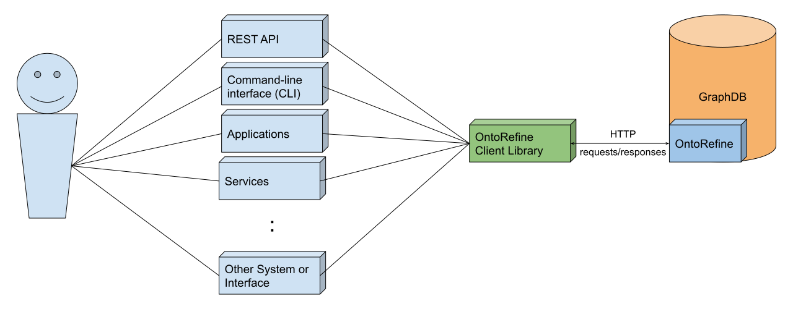
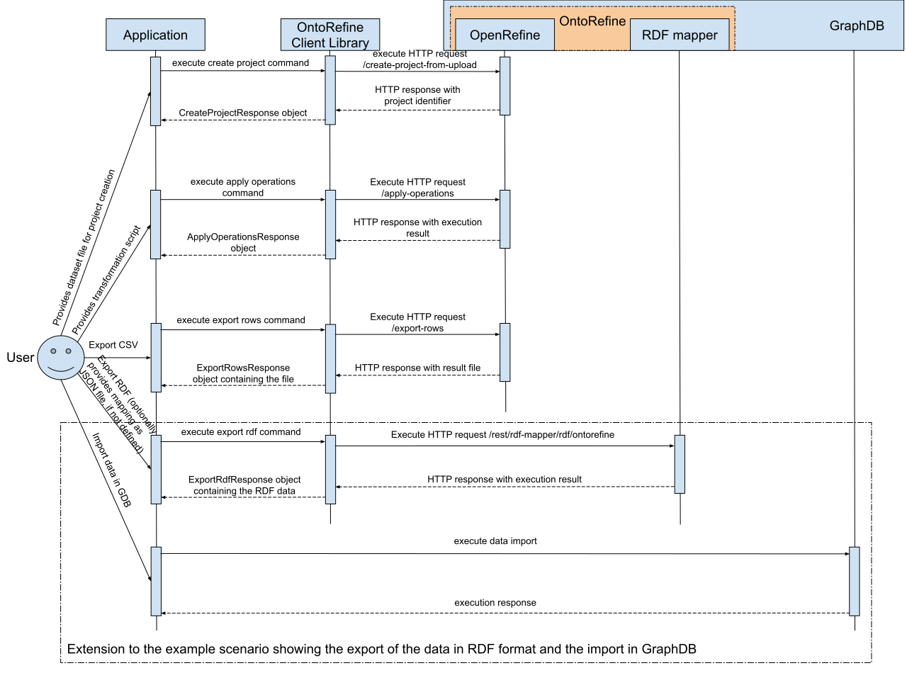

# Architecture Overview

## General

This document provides information for the basic architecture of the library and how it realizes the communication
between the actual user and `OntoRefine`.

Before talking about the architecture and design of the library, we encourage the reader to get familiar with the
[OntoRefine](https://graphdb.ontotext.com/documentation/free/loading-data-using-ontorefine.html) and more
particularly what it is, what are the benefits from such tool and what are the extra functionalities that it provides
over the Google's `OpenRefine`.

  
tl;dr

  <i>
    OntoRefine is based on the open source <a href="https://openrefine.org/">OpenRefine</a> data transformation tool,
    supported and maintained by Google. It extends the standard functionalities of the `OpenRefine` by adding quick
    mapping of the data to RDF format, which can be directly stored in GraphDB. OntoRefine user interface is integrated
    in the GraphDB Workbench from where the user can process the different dataset and import the data to the database.
  </i>

The client library communicates with OntoRefine through HTTP requests, where every command represents call to different
endpoint. All of the functionalities, which OntoRefine supports are exposed via REST API, but most of the requests are
hard for configuration as they either have a lot of parameters or single JSON document representing the different
options for execution of the specific operation.

The library itself allows making the request simpler by providing sensible defaults for the most parameters or easier
provision of the required parameters and configurations for the actual requests. Furthermore the commands are
implemented in similar standard, which makes the usage of the library intuitive very easy.

  
  

    <i>
      <b>Figure 1: Basic architecture diagram</b>
    </i>
  

On the above diagram is represented the basic architecture of the library. The components represented with the blue
cuboids are the different services, applications or APIs, which can use the library in order to complete specific
functionality. The green one is represents the library itself, which hava a connection to the OntoRefine tool integrated
within GraphDB.

## Simple Communication Flow

To present an example of the simple communication workflow between the different components we are going to use the
scenario and the code example from [Usage](README.md#Usage) section in the README document.

The components that are shown in the diagram are as follows:

- **GraphDB**, which will be used to present the flow of importing RDF data in it after the data is transformed and
  exported in RDF format. Contains the `OntoRefine` as integrated tool.
- **OntoRefine**, used for the data transformation and data export via the library. It wraps in the `OpenRefine` and
  the [RDF mapper](https://github.com/Ontotext-AD/mapping-ui) which is Ontotext extension providing the transformation
  of the data to the RDF via defined mapping.
- **OntoRefine Client Library**, which will be the connecting point between the application and OntoRefine. Through it
  the application will implement the actual scenario.
- **Application**, which will use the client library to complete the pipeline described in the scenario. In terms of
  the example that we are using, the application itself can be the `Example` class, invoked in some way.
- **Actor/Client/User** is the one that uses the application to complete specific task.

  
  

    <i>
      <b>Figure 2: Basic workflow diagram based on the example shown in the Usage section of the main README document</b>
    </i>
  

